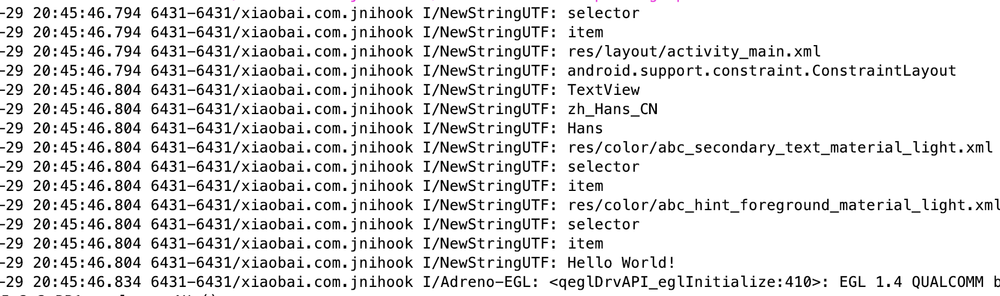

### 用途

用于hook JNI相关函数

### 用法

可以参考jnihook 目录下的Main.cpp文件

* 创建回调类需要继承JNIInterface如下:并在回调类中实现要hook的方法

```c++

class Test : public JNIInterface {
public:
    void NewStringUTF(JNIEnv *env, const char *string) override {
        JNIInterface::NewStringUTF(env, string);
        //此处用编写拦截 代码
        LOGI(string);
    }
};

```

* 调用JniHook中的相关方法对指定方法进行hook，如：

```c++

    //获取实例 传入参数
    JniHook *jniHook = JniHook::getInstance(env, test);
    //hook 对应方法
    jniHook->hookNewStringUTF();

```

* enjoy it

### 效果图



### 其他

只测试了几个常规函数，非常规没测试,后面会补充通过 jobjet、jclass 等拿到对应的类名和方法名

### 参考

Hook方案来自：[https://github.com/F8LEFT/FAInHook](https://github.com/F8LEFT/FAInHook)
Arm64hook方案来自：[https://github.com/Rprop/And64InlineHook](https://github.com/Rprop/And64InlineHook)

